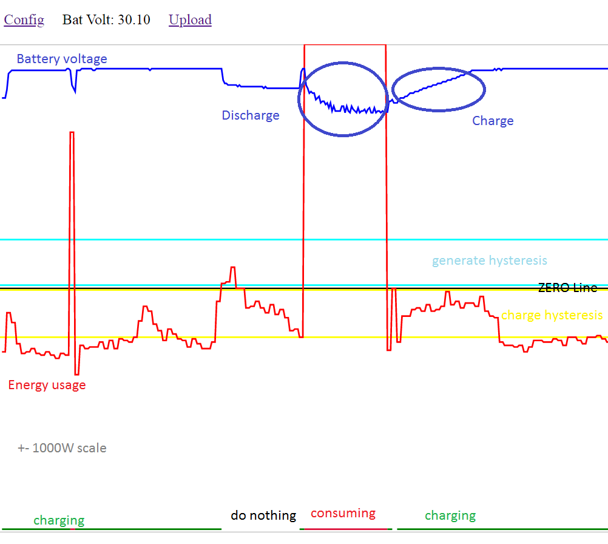

# SolarBatControl
A relay battery controller using ShellyEM3 to control charge/discharge.

This project need a Shelly EM3 ($110), a batery capable 150W grid tie inverter (Y&H $30) and a 30V 5A DC charger ($50). It runs on a esp8266 4-relay board ($8). And you need a battery, i use 24V 30ah LiFePo4.

The 10 ohm resistor pre-charges the inverter condensers. Not optional. The two discharge relais are in parallel because the current can exceed the relais specs.
The battery can be charged with a solar charger. Connect directly to batery not over DC-charger pin.

Function:
The device produces 150W or consumes 150W in order to flatten out the energy consumption / production.

If shelly reports more than 200W solar excess the DC charger is activated. The charger is switched off if less than 10W excess solar.
If shelly reports more than 200W consumption the inverter is switched on. Switched off at less than 10W consumption, or battery low. Those levels are settable in "config".

The communication relay - shelly is WiFi. The relay board has its own webserver showing the graph of battery voltage and energy consumption.
