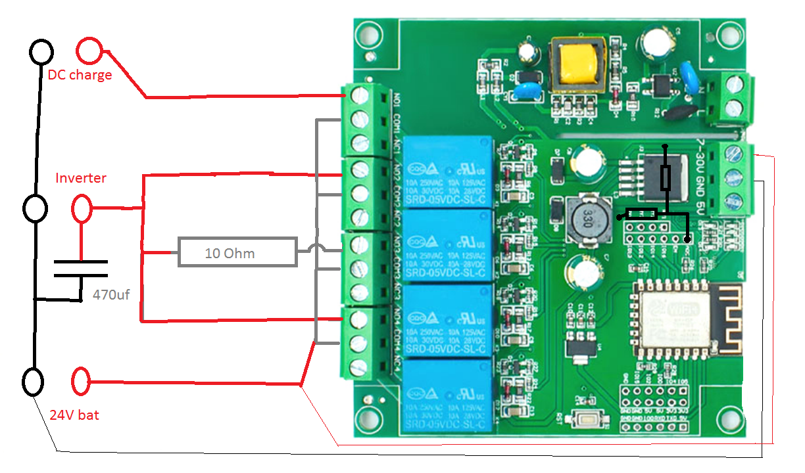

# SolarBatControl
A relay battery controller using ShellyEM3 to control charge/discharge

This project need a Shelly EM3 ($110), a batery capable 150W grid tie inverter (Y&H $30) and a 30V 5A DC charger ($50). It runs on a esp8266 4-relay board ($8).

